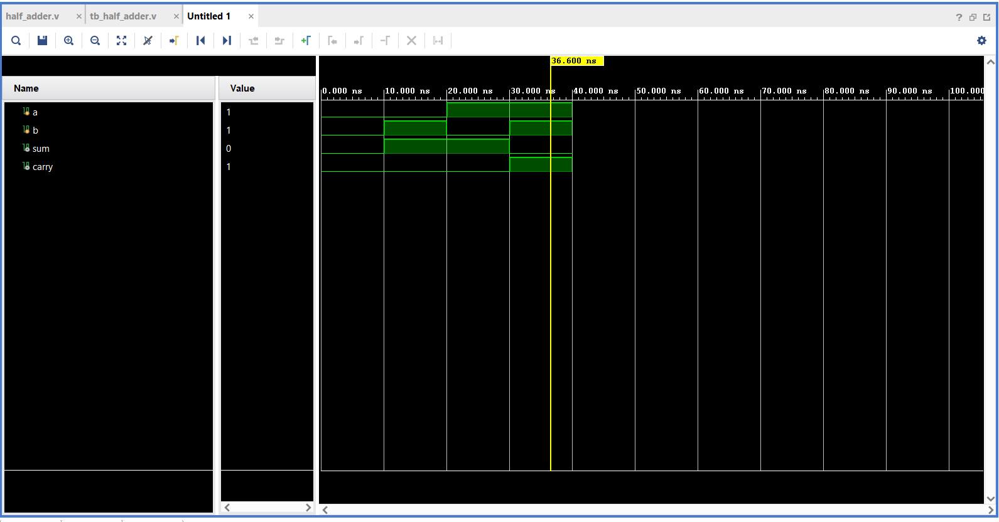

# Half Adder — Verilog HDL Implementation

A 1-bit Half Adder designed and verified using Verilog HDL, synthesized on Xilinx Vivado targeting the **xc7a35tcpg236-1** FPGA device.

---

## 📌 Overview

A Half Adder is a fundamental combinational circuit that adds two single-bit binary inputs and produces a **Sum** and a **Carry** output.

| Input A | Input B | Sum (A ⊕ B) | Carry (A · B) |
|:-------:|:-------:|:-----------:|:-------------:|
| 0       | 0       | 0           | 0             |
| 0       | 1       | 1           | 0             |
| 1       | 0       | 1           | 0             |
| 1       | 1       | 0           | 1             |

---

## 🗂️ Project Structure

```
half-adder-verilog/
│
├── half_adder.v          # RTL design — core module
├── tb_half_adder.v       # Testbench — functional verification
├── logic_design.png      # Elaborated schematic from Vivado
├── simulation.png        # Waveform output from simulation
└── README.md
```

---

## ⚙️ Design Details

**Module:** `half_adder`  
**Inputs:** `a`, `b` (1-bit each)  
**Outputs:** `sum`, `carry` (1-bit each)

```verilog
module half_adder(
    input a, b,
    output sum, carry);
    
    assign sum   = a ^ b;   // XOR gate
    assign carry = a & b;   // AND gate
endmodule
```

The design uses **continuous assignments** — minimal, clean, synthesizable RTL.

---

## 🧪 Testbench

The testbench (`tb_half_adder.v`) applies all four possible input combinations with a 10 ns delay between each:

```verilog
initial begin
    a=0; b=0; #10
    a=0; b=1; #10
    a=1; b=0; #10
    a=1; b=1; #10 $finish;
end
```

---

## 📊 Simulation Results

Waveform verified in Vivado Simulator — all outputs match the expected truth table.



---

## 🔌 Elaborated Schematic

The synthesized RTL schematic shows an **RTL_AND** gate for carry and an **RTL_XOR** gate for sum, with shared inputs `a` and `b`.


---

## 🛠️ Tools Used

- **Language:** Verilog HDL
- **IDE / Synthesis Tool:** Xilinx Vivado
- **Target Device:** xc7a35tcpg236-1 (Artix-7 FPGA)
- **Simulation:** Vivado Simulator (XSIM)

---

## 🚀 How to Run

1. Clone this repository
2. Open Xilinx Vivado and create a new project
3. Add `half_adder.v` as the design source and `tb_half_adder.v` as the simulation source
4. Run **Behavioral Simulation** to view the waveform
5. (Optional) Run **Elaboration** to view the RTL schematic

---

## 📚 Concepts Demonstrated

- Combinational logic design in Verilog
- RTL coding with continuous assignments
- Testbench writing and functional simulation
- Gate-level synthesis and schematic interpretation
- FPGA design flow using Xilinx Vivado

---

 
Electronics & Communication Engineering  
[LinkedIn](#) · [GitHub](#)
