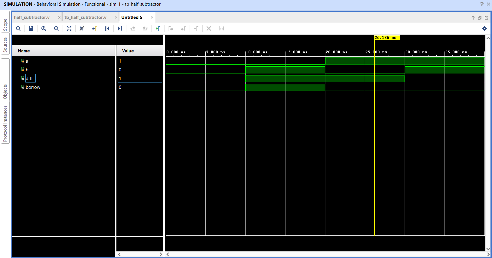
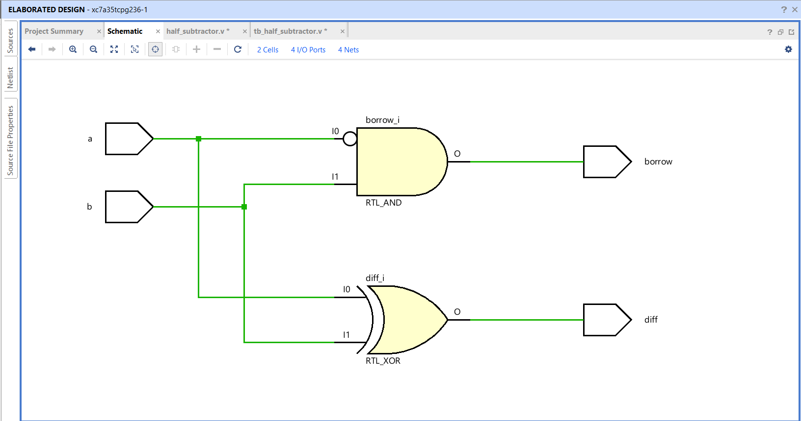

# Half Subtractor — Verilog HDL Implementation

A 1-bit Half Subtractor designed and verified using Verilog HDL, synthesized on Xilinx Vivado targeting the **xc7a35tcpg236-1** (Artix-7) FPGA device.

---

## 📌 Overview

A Half Subtractor is a combinational circuit that subtracts two single-bit binary inputs and produces a **Difference** and a **Borrow** output.

| Input a | Input b | Diff (a ⊕ b) | Borrow (~a & b) |
|:-------:|:-------:|:------------:|:---------------:|
| 0       | 0       | 0            | 0               |
| 0       | 1       | 1            | 1               |
| 1       | 0       | 1            | 0               |
| 1       | 1       | 0            | 0               |

> **Borrow** is high only when `a = 0` and `b = 1` — i.e., when you subtract a larger bit from a smaller one.

---

## 🗂️ Project Structure

```
half-subtractor-verilog/
│
├── half_subtractor.v       # RTL design — core module
├── tb_half_subtractor.v    # Testbench — functional verification
├── design.png              # Elaborated schematic from Vivado
├── simulation.png          # Waveform output from simulation
└── README.md
```

---

## ⚙️ Design Details

**Module:** `half_subtractor`  
**Inputs:** `a`, `b` (1-bit each)  
**Outputs:** `diff`, `borrow` (1-bit each)

```verilog
module half_subtractor(
    input a, b,
    output diff, borrow
);

    assign diff   = a ^ b;    // XOR gate
    assign borrow = (~a) & b; // NOT-AND gate

endmodule
```

The borrow logic inverts `a` before ANDing with `b` — capturing the case where the minuend is less than the subtrahend.

---

## 🧪 Testbench

The testbench (`tb_half_subtractor.v`) applies all four input combinations with 10 ns between each:

```verilog
initial begin
    a=0; b=0; #10;
    a=0; b=1; #10;
    a=1; b=0; #10;
    a=1; b=1; #10;
    $finish;
end
```

---

## 📊 Simulation Results

Waveform verified in Vivado Simulator — all outputs match the expected truth table.



---

## 🔌 Elaborated Schematic

The synthesized RTL schematic shows:
- **RTL_XOR** gate for the Difference output
- **RTL_AND** gate (with inverted `a` input) for the Borrow output

2 Cells · 4 I/O Ports · 4 Nets



---

## 🛠️ Tools Used

| Tool | Details |
|------|---------|
| Language | Verilog HDL |
| IDE / Synthesis | Xilinx Vivado |
| Target Device | xc7a35tcpg236-1 (Artix-7 FPGA) |
| Simulator | Vivado XSIM |

---

## 🚀 How to Run

1. Clone this repository
2. Open Xilinx Vivado and create a new project
3. Add `half_subtractor.v` as the design source and `tb_half_subtractor.v` as the simulation source
4. Run **Behavioral Simulation** to view the waveform
5. (Optional) Run **Elaboration** to view the RTL schematic

---

## 📚 Concepts Demonstrated

- Combinational logic design in Verilog
- Borrow logic using inverted input (NOT-AND)
- Testbench writing and functional simulation
- Gate-level synthesis and schematic interpretation
- FPGA design flow using Xilinx Vivado on Artix-7

---

Electronics & Communication Engineering  
[LinkedIn](#) · [GitHub](#)
